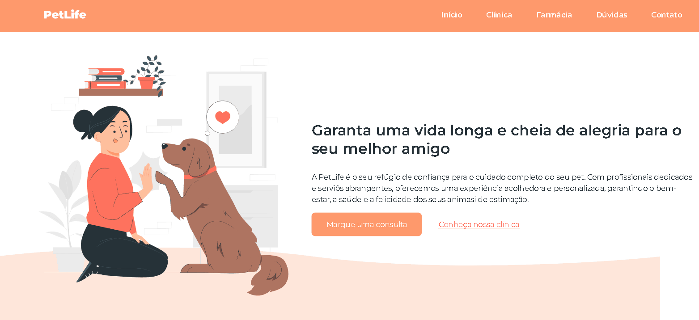

<h1 align="center"> PetLife </h1>

Programa gratuito, promovido pela OneBitCode para ensino de tecnologias WEB.

  <a href="#-tecnologias">Tecnologias</a>&nbsp;&nbsp;&nbsp;|&nbsp;&nbsp;&nbsp;
  <a href="#-projeto">Projeto</a>&nbsp;&nbsp;&nbsp;|&nbsp;&nbsp;&nbsp;
  <a href="#-layout">Layout</a>

  

## 🚀 Tecnologias

Esse projeto foi desenvolvido com as seguintes tecnologias:

- HTML e CSS
- JavaScript
- Git e Github

## 💻 Projeto

O PetLife é uma landing page para usar como apresentação de uma clínica fictícia de veterinária e petshop.

- [Assistir aulas](https://www.onebitcode.com/aulasminicurso)

- [Visualise o projeto finalizado](https://weesduarte.github.io/petLife/)

## 🔖 Layout

Você pode visualizar o layout do projeto através [DESSE LINK](https://www.figma.com/proto/ObmGmIUdpg2L4HbgggwcIy/Funil-OBC-Start-2.0?type=design&node-id=3-8241&t=0huRzi6fPHQQnttn-1&scaling=scale-down-width&page-id=0%3A1).